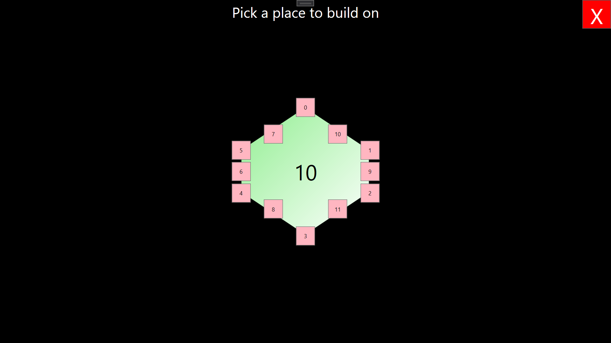

# Dokumentace
Program je rozdělen na dvě části logika hry a vizualizace. Na hru bylo použito WPF C#.
## Rozdělení hrací logika vs vizualizace
Hrací logika se nachází v souboru Game.cs. Vizualizace je udělaná ve WPF C#. Program je rozdělen podle oken každému oknu náleží soubor .xaml a .xaml.cs. Vizualizace používá zejména třídy, které začínájí klíčovým slovem Drawn.

Smysl jednotlivých oken:
* App - Nachází se zde věci týkající se celé aplikace.
* WindowPickPlayers - Vytvoří okno, kde probíhá většina hry s hrací plochou figurkami a kartami.
* WindowHexagon - zoom na jedno hrací pole a příslušné interakce s tím spjaté
* WinnerWindow - okno s informacemi o výhře
* SellWindow - okno s možnostimi pro prodej surovin

## Hrací pole
Vizuálně je pole reprezentováno jako List <Polygon>, je tvořeno Polygonem ve tvaru Hexagonu, který jde vytvořit v GenericWindow. Vrcholy jsou určeny PointsCollection. Polygon zajištuje pouze obrys a barvu. Číslo pole a obrys, který se zobrazí po najetí myší je dán Button. Buttons jsou uložené ve svém vlastním poli ale jsou indexované stejně jako Polygony.

Pole je vytvářeno jak v případě Polygon , tak v případě Button od 18. pole, to je pole dole vpravo. a postupujeme doleva a poté nahoru. Nejprve je vytvořeno celé pole Polygon a poté až Buttons, aby byli přístupné pro klikání. Červený obrys zobrazený po najetí myší je proveden v .xaml. 

Během loop při tvorbě jsou Polygony i Buttony očíslovány od 0 do 18.

Indexování je poté využito při namapování v herní logice, kde máme List<Hexagon>, kde sobě vzájemně odpovídají stejné indexy, obsahující ínformace o tom, jak má pole vypadat.

Barvy ani čísla na poli se nemění ale zůstávájí defaultně stále stejná.

HexagonWindow neboli zoom na políčko z hracího pole, pak využívá indexování Buttonů k opět namapování na správné pole. Indexy jsou uložené v názvu buttonů a v GenericWindow jsou funkce, které slouží k jejich získání.

Hrací pole mají jestě i sousedy Neighbour, který obsahuje všechny pozice, na kterých může být sousední pole. Pokud není jedná se o null, pokud je je přiřazen patřičný Hexagon.

## Figurky
Figurky se vizuálně zobrazují projetím všech polí (v pořadí indexování). Zobrazí se pouze budovy a cesty, které nemají v logice hry barvu Color.None. 

Figurky už jsou předem přítomné v logice, jejich barva je ale nastavena na Color.None. Pokud chceme nějakou figurku zobrazit je třeba vytvořit figurku novou (barvu lze nastavit jen jako init) a uložit ji v logice na správné místo, to je každy Hexagon má svůj List<Buildings> délky 6, určený pro Building to je města a vesnice a List <Road> délky 6 určený pro cesty. 

V programu jsou budovy indexovány od 0 do 5 a cesty 6 do 11, jako například Buttons. Je teda potřeba počítat s tím, že při stavbě cest je potřeba odečíst 6 k přístupu do List<Road>. Viz indexování obrázek. 

Jelikož má každé pole seznam budov a cest zvlášť musí se dávat pozor, aby cesta nebo budova byla vždy uložena i do Listu sousedního pole.

Za separátní figurku můžeme považovat piráta, je reprezentovaný separátní třídou a narozdíl od ostatních se může i po umisťování přemisťovat. V aktivitě přemisťování piráta je povolen zoom na pole.

Jeden hráč má jednu barvu figurek a slouží to jako identifikátor jeho vlastnictví.

Figurky, které má hráč zatím pouze v inventáři jsou reprezentované jako List<SamePawnsSet> pro daného hráče, tato SamePawnsSet třída vždy určuje sadu jednoho typu, to je jenom cesty, jenom vesnice nebo jenom města a jejich počet, který má hráč v inventáři.

Vizuálně jsou figurky v inventáři reprezentovány jako Button, pro každý SamePawnSet jeden Button. Button obsahuje PawnType referenci v názvu nebo contentu, což slouží k jeho mapování.

## Karty 
Karty jsou reprezentované v logice jako List<SameCardSet>, SameCardSet jsou všechny karty, které jsou stejného materiálu Material pro daného hráče. Na třídě je určen počet pro daný Material. Pokud tedy chceme celkový počet karet hráče musíme projít celý tento List a počty jednotlivých SameCardSet sečíst.

Karty jsou vizuálně reprezentované jako Button, každému SameCardSet z List náleží jeden Button. Button v názvu obsahuje název dané suroviny, což slouží k jeho namapování.

## Stavba
Stavba může probíhat, pouze za vhodných hodnot z enum Activity, to je pouze za aktivit týkající se stavby. Je povolen zoom na pole. V zoom modu se zobrazí tlačítka, kde může hráč stavět určena ověřování pomocí CheckBuildBuilding() nebo CheckBuildRoad(), jedná se tedy pouze o validní pole. Jednotlivá tlačítka jsou o indexovaná. Pro budovy opět 0 do 5 a cesty 6 do 11.

Ke kontrole staveb a stavbě samotné jsou využívány různé funkce vracející seznam indexů cest připojených na budovu nebo seznam indexů budov připojených na cestu. Vrací se vždy hexagon a index na daném hexagonu, abychom věděli o jakém sousedovi mluvíme. Nemusí se tedy odkazovat na současný hexagon.

Ihned po umistění budovy dostává hráč body a taky je kontrolováno, zda hráč vyhrál.

## Ovládání tlačítek a aktivity
Akce různých tlačítek je často závisla na enum Activity, která určuje která akce zrovna probíhá. Některá tlačítka se zobrazí jen při některých aktivitách. Například také červený obrys při najetí na hrací políčko je zobrazován vždy ale jen pokud je správná aktivita na něj lze kliknout.

Po různých aktivitách jako stavba nebo přesun piráta je třeba myslet na to, aby došlo ke změně aktivty a také vizuálně updatovaní příslušných zobrazených karet nebo Player label, aby došlo k aktualizování informace.

## Hod kostkou a změna hráče
Hod kostkou probíhá automaticky po přepnutí SwitchPlayers. Dojde k tomu, ale jen v případě, že nejsme v ve fázi počáteční stavby, je to určeno Activity. Pokud dojde k hodu kostkou jsou i automaticky přiřazeny karty nebo ztraceny, případně se přepne na Activity.MovingPirate a je třeba přesunout piráta.

Přepnutí hráče a tedy i hod kostkou může nastat pouze při stisku tlačítka NextPlayer.

## Prodej a reprezentace banky
V prodeji jsou zobrazovány hráči a jejich karty. Banka je taky reprezentovaná jako Player, jen se u ní až se začátkem prodeje nastaví nabízené suroviny. 

Obchod nemůže protihráč nijak odmítnout.

